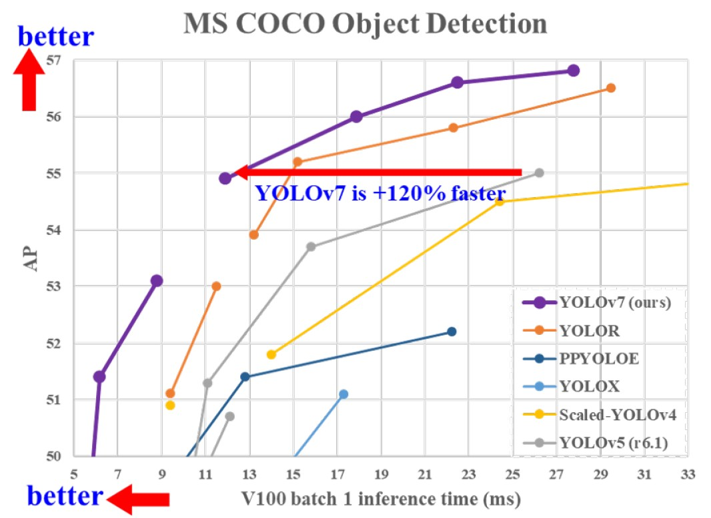

# 운전자의 얼굴 인식을 통한 졸음 운전 탐지

## 0. Period

    2022.11.30 ~ 2022.12.05

## 1. Data Source

### 1.1. Data

[졸음운전 예방을 위한 운전자 상태 정보 영상](https://www.aihub.or.kr/aihubdata/data/view.do?currMenu=115&topMenu=100&aihubDataSe=realm&dataSetSn=173)

### 1.2. Why

- 2022년 현재까지도 졸음 운전은 교통사고의 주요한 원인 중 하나
- [2022년 11월 고속도로 교통사고 사망자 중 90%는 졸음 운전이 원인](https://newsis.com/view/?id=NISX20221125_0002100808&cID=10401&pID=10400)
- 그래서 실시간에 가까운 졸음 운전 탐지 기술이 요구됨

## 2. Hypothesis

 (1) 졸음 운전을 감지할 수 있는 요소는 눈을 감았는지에 대한 여부이다.<br>
 (2) 눈을 감았는 지 여부를 확인하기 위해서는 얼굴 구성요소를 탐지할 수 있어야한다 <br>
 (3) 졸음 운전을 감지할 수 있기 위해서는 Object Detection을 수행해야한다.<br>

## 3. preprocessing

### 3.1. Data Selection

 - 주어진 데이터는 약 35만 장.
 - 주어진 데이터를 모두 학습하는 것은 불가능에 가까움
 - 따라서 실제 도로 주행 데이터, 준 통제 환경, 통제 환경 데이터 중에 가장 표정 요소가 다양한 통제 환경 데이터 사용 
 - 통제 환경 데이터는 250명의 운전자에게 주어진 시나리오 대로 통제된 환경에서 촬영된 데이터로 가장 다양한 표정 데이터가 담김
 - 이러한 통제 환경의 데이터도 11만장이 넘는 방대한 데이터이기 때문에 기간 내에 학습하기 위해 순서대로 2만 2천장을 추려내어 학습함

### 3.2. Data Preprocessing
- 해당 프로젝트에서 사용한 Model인 [Yolo v7](https://github.com/WongKinYiu/yolov7)을 사용하기 위해서 image와 data annotation은 아래와 같은 형태로 데이터 파일에 존재해야함
```
preprocessed_dataset
└────train
|    └────images
|    |    └────── train1.jpg    
|    |    └────── train2.jpg
|    └────labels
|         └────── train1.txt    
|         └────── train1.txt
└────val
     └────images
     |    └────── val1.jpg    
     |    └────── val2.jpg
     └────labels
          └────── val1.txt    
          └────── val2.txt
```
- 그리고 각각의 label 파일에는 탐지할 객체마다 클래스 번호, 객체의 x 중앙값, y 중앙값, 너비, 높이 값이 각각 [0, 1] 내의 값으로 표현되어 한 줄로 표현되어야함. 객체는 하나 이상일 수 있음
- 이를 위해 JSON으로 주어진 label을 txt 형태로 바꾸고, 이미지 파일과 레이블 파일들을 데이터 디렉토리를 모델이 원하는 구조로 조직화함

### 3.3. Classification
- 졸음 운전 감지를 위해서는 우선 감은 눈을 감지해야하며 추가적으로 하품 여부 등으로 졸림 여부를 탐지하기 위해 입이 열렸는지 닫혔는지를 감지해야한다.
- 이를 위해 열린 양 눈과, 입의 개폐 여부에 따른 클래스를 따로 구성하였다.
  
## 4. Used Model : YOLO v.7

### 4.1 Why

 - 사용한 데이터에서 어떤 장면이 졸음 운전 중인지 또는 졸음 중인지에 대한 Annotation이 없기 때문에 Classification 문제로 이를 해결할 수 없었다.
 - 그래서 잠재적으로 눈을 감았는지 여부를 파악하기 위해 object detection 모델을 사용함.
 - 해당 모델은 운전 중에 실시간으로 사용될 것을 요구받기 때문에 처리속도가 빠른 YOLO 모델, 그 중에서도 가장 최신의 모델인 v7을 사용함



## 5. Results

### 5.1. training summary

- 약 2만 2천장의 이미지로 30 epochs 학습하였고 6천장의 image를 validation으로 사용함


- x 축은 epochs를 나타낸다.

- Box는 예측된 boundary box의 위치와 크기에 대한 에러인 localization error을 나타낸다.
- Objectness는 예측한 boundary box에 물체가 있다는 것에 대한 예측에 대한 confidence loss를 나타낸다. 
- mAP@ 0.5는 Ground true Box와 절반 이상이 겹치는 예측을 하면 맞게 평가함.
- map@ 0.5:0.95는 0.05 크기로 0.5부터 0.95까지의 IoU에 대한 평균 average precision

### 5.2. Confusion matrix


- 결과를 살펴보면 cigar와 background를 잘 구별해내지 못했지만 가장 중요한 요소인 양 눈의 열림과 닫힘에 대해서는 잘 판별하는 것을 확인할 수 있다.


### 5.3. Prediction Example

### 5.3.1. with validation data


- 위의 사진은 validation의 label이고 아래의 이미지는 validation image에 대한 prediction이다.
- sunglass를 쓰고 있는 경우 선글라스에 반사된 빛의 유무에 따라 눈을 감고 뜨고 있다고 예측하는 문제가 존재한다.
- 하지만 입이 개폐하는 것과 뜬 눈에 대해서는 잘 감지하는 것을 확인할 수 있다.

### 5.3.2. with daytime image

- 야간 상황을 상정한 데이터를 학습하였으나 우리가 원하는 target object인 눈 및 추가적으로 입에 대해서는 boundary box 및 classification이 잘 이루어지는 것을 확인할 수 있음


## 6. Limitaition and To Do

- 졸음에 대한 정보만 파악하는 시스템만 구성하고 이후에 대한 구현은 현재까진 없음
- 데이터에서 졸음에 대한 별도의 Label이 없음
- 선글라스 등이나 안경 등으로 눈에 대한 feature이 차단되거나 왜곡되는 경우에 제대로 탐지 못함
- 웹캠을 통해 실시간으로 detection하는 것을 시도했지만 수행하지 못함
- 단순히 눈을 감은 것으로 졸음 운전을 정의하는 것은 한계가 존재함. (예를 들어 일상적인 눈깜빡거림이 감지되는 경우)
- 위의 문제를 해결하기 위해서는 몇 프레임 이상 눈을 감고 있을 경우 졸음 운전이라 파악할 수 있어야함.

## 7. install and execute

### 7.1. requirements

- cuda를 구동할 수 있는 gpu
- [Pytorch, GPU](https://pytorch.org/get-started/locally/) 버전 설치
- cudatoolkit 및 cudnn 설치
- 설치 후 다음의 코드를 통해 pytorch가 cuda를 사용하는지 확인

```python
import torch
torch.cuda.is_available()
```

### 7.2. install


- 우선 yolo v7을 clone 한다.

```shell
git clone https://github.com/WongKinYiu/yolov7
```

- yolo v7이 요구하는 모듈 설치

```
pip install -qr ./yolov7/requirements.txt
```


- 아래의 weight 파일을 받아서 Face_object_detection/weights 에 넣는다.

- [best.pt](https://drive.google.com/file/d/1r0bOTZMSbedLHN78KRZa6G2mcw_d6JEM/view?usp=sharing)

- 만약 아래와 같은 문장을 출력하면서 실행이 안되는 경우
```
module 'brotli' has no attribute 'error'
```
 아래의 문장을 실행하여 brotlipy 설치
 
    conda install -c conda-forge brotlipy

- 만약 실행 중에 아래와 같은 문제가 생기면 yolo v7 내부에 있는 loss.py 파일을 아래의 링크를 참조하여 수정한다.

  - Error fix : [Indices should be either on cpu or on the same device as the indexed tensor](https://stackoverflow.com/questions/74372636/indices-should-be-either-on-cpu-or-on-the-same-device-as-the-indexed-tensor)


### 7.3. execute

- model.ipynb 참조
